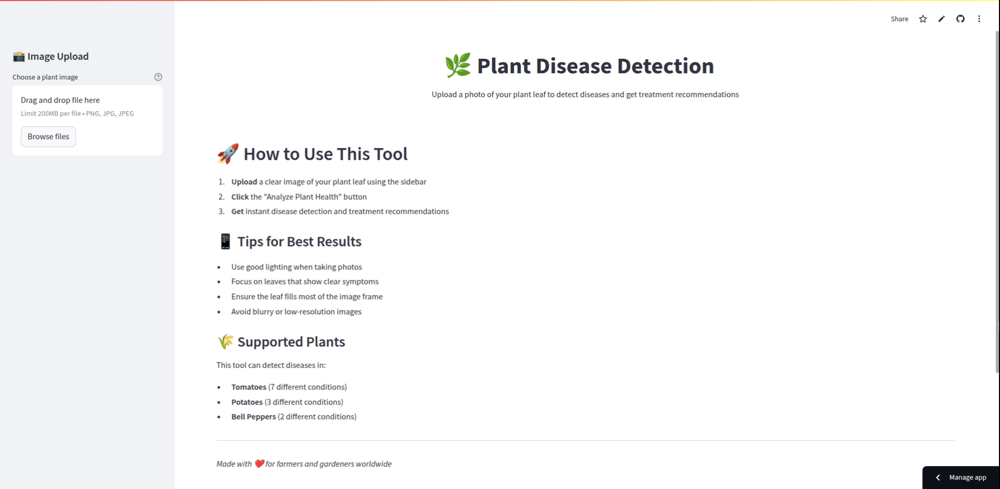
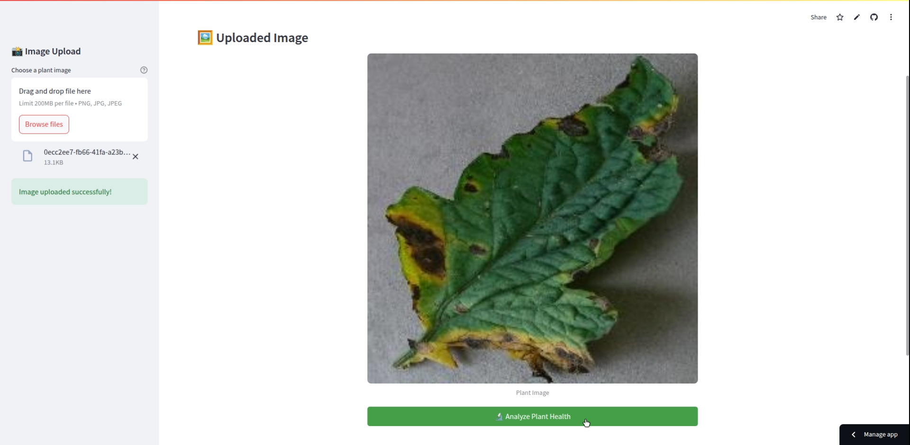
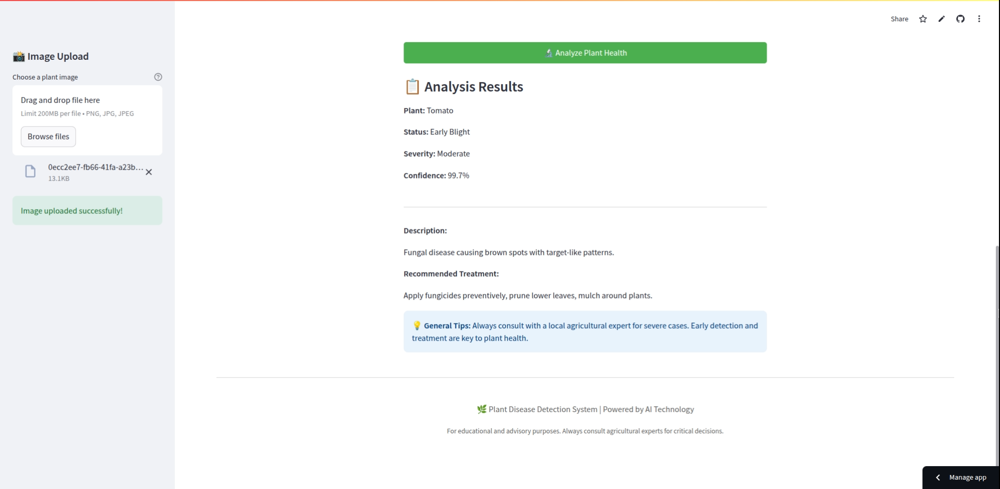

# 🌿 Plant Disease Detection App


[](https://plant-disease-detection-app-app-zya8ie.streamlit.app/)
[](https://github.com/zaidzaihan/plant-disease-detection-app)

---

## 🧠 Overview

This AI-powered app detects plant diseases from images of leaves using a pre-trained Convolutional Neural Network (CNN). Built with **Streamlit**, it provides farmers, gardeners, and researchers with fast, reliable disease detection and treatment advice.

🧪 **Try it now**: [plant-disease-detection-app-app-zya8ie.streamlit.app](https://plant-disease-detection-app-app-zya8ie.streamlit.app/)

---

## 🩺 What It Can Detect

The model was trained to detect **15 conditions** across **3 plant types**:

### 🥔 Potato
- Early Blight
- Late Blight
- Healthy

### 🌶️ Bell Pepper
- Bacterial Spot
- Healthy

### 🍅 Tomato
- Bacterial Spot
- Early Blight
- Late Blight
- Leaf Mold
- Septoria Leaf Spot
- Spider Mites
- Target Spot
- Yellow Leaf Curl Virus
- Mosaic Virus
- Healthy

Each diagnosis includes:
- 🌡 **Severity level**
- 📄 **Description**
- 💊 **Recommended treatment**

---

## 🖼 Screenshots

<p align="center">
  
  
  
</p>


---

## ⚙️ Environment Setup

> ✅ Tested on **Python 3.11.9**  
> ⚠️ TensorFlow **does not support** Python 3.12 or 3.13 as of now.

### 📦 Requirements

Install all required packages:
```bash
pip install -r requirements.txt

Awesome!! Let’s upgrade your `README.md` to include:

✅ **Badges** (for Python version, license, and Streamlit app link)
✅ **Screenshots section** to showcase your app visually
✅ Still clean, friendly, and easy for devs and non-devs

---

Here’s your new 🔥 enhanced `README.md`:

````markdown
# 🌿 Plant Disease Detection App


[](https://plant-disease-detection-app-app-zya8ie.streamlit.app/)
[](https://github.com/zaidzaihan/plant-disease-detection-app)

---

## 🧠 Overview

This AI-powered app detects plant diseases from images of leaves using a pre-trained Convolutional Neural Network (CNN). Built with **Streamlit**, it provides farmers, gardeners, and researchers with fast, reliable disease detection and treatment advice.

🧪 **Try it now**: [plant-disease-detection-app-app-zya8ie.streamlit.app](https://plant-disease-detection-app-app-zya8ie.streamlit.app/)

---

## 🩺 What It Can Detect

The model was trained to detect **15 conditions** across **3 plant types**:

### 🥔 Potato
- Early Blight
- Late Blight
- Healthy

### 🌶️ Bell Pepper
- Bacterial Spot
- Healthy

### 🍅 Tomato
- Bacterial Spot
- Early Blight
- Late Blight
- Leaf Mold
- Septoria Leaf Spot
- Spider Mites
- Target Spot
- Yellow Leaf Curl Virus
- Mosaic Virus
- Healthy

Each diagnosis includes:
- 🌡 **Severity level**
- 📄 **Description**
- 💊 **Recommended treatment**

---

## 🖼 Screenshots

| Upload Leaf Image | Detection Results |
|-------------------|-------------------|
|  |  |


---

## ⚙️ Environment Setup

> ✅ Tested on **Python 3.11.9**  
> ⚠️ TensorFlow **does not support** Python 3.12 or 3.13 as of now.

### 📦 Requirements

Install all required packages:
```bash
pip install -r requirements.txt
````

---

## 🚀 Running Locally

### 1. Clone the Repository

```bash
git clone https://github.com/zaidzaihan/plant-disease-detection-app.git
cd plant-disease-detection-app
```

### 2. (Optional) Create a Virtual Environment

```bash
python -m venv venv
source venv/bin/activate  # On Windows: venv\Scripts\activate
```

### 3. Install Requirements

```bash
pip install -r requirements.txt
```

### 4. Run the App

```bash
streamlit run app.py
```

Then open your browser to [http://localhost:8501](http://localhost:8501).

---

## ☁️ Deploying on Streamlit Cloud

1. Fork this repository to your own GitHub
2. Go to [streamlit.io/cloud](https://streamlit.io/cloud)
3. Click **“New App”** > Select your repo
4. Set `app.py` as the main file
5. Click Deploy 🚀

> 📦 The trained model (`best_model.h5`) is downloaded automatically using `gdown` on first launch.

---

## 🧬 How It Works

* **Input**: 224x224 RGB image of a plant leaf
* **Model**: CNN trained with TensorFlow
* **Output**: Softmax prediction of class with confidence
* **Result**: Displays plant name, disease, severity, confidence level, description, and treatment

---

## 📂 Project Structure

```
.
├── app.py                # Main Streamlit app
├── requirements.txt      # Python dependencies
├── README.md             # This file!
└── (auto-downloads)      # Model from Google Drive via gdown
```

---

## 💡 Tips for Best Results

* Use clear, **close-up leaf images**
* Ensure **good lighting**
* Avoid blur, noise, and background clutter
* Focus on leaves showing visible symptoms

---

## 🧑‍💻 Contributions

Feel free to:

* Improve model accuracy
* Add new plant types or diseases
* Translate into local languages
* Style or optimize UI

PRs and issues are always welcome! 🙌

---

## 📄 License

This project is licensed under the **MIT License** — you're free to use, modify, and distribute it.

---

## 👨‍🔬 Author

Built by **[Zaid Zaihan & Adha Rizwan](https://github.com/zaidzaihan/plant-disease-detection-app)**
Inspired by a mission to empower farmers with accessible AI.

---

*“Made with ❤️ for the green thumbs of the world.”*
